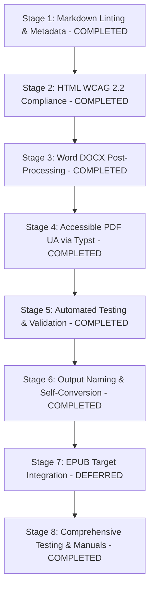

# Accessibility Improvement Plan (WCAG 2.2 Compliance)

This document outlines a stage-by-stage plan to improve the document conversion pipeline ([convert_md.py](file:///C:/salo/acb/quill/equation_converter/convert_md.py)) for Markdown, MS Word (DOCX), and HTML formats. The primary goal is to ensure full compatibility with the **WCAG 2.2 guidelines (Levels A, AA, and AAA)** and enhance mathematical equation readability for assistive technologies.

---

## Plan Overview


---

## Stage 1: Document Auditing & Metadata Enforcement
Before conversion begins, we must ensure the source Markdown is structurally sound and contains necessary accessibility metadata.

### 1. Structure Verification (WCAG 1.3.1 - Info and Relationships)
*   **Heading Hierarchy Checker**: Implement a lightweight validator in [convert_md.py](file:///C:/salo/acb/quill/equation_converter/convert_md.py) to parse Markdown headings. 
    *   **Rule**: Prevent heading level skipping (e.g., `## Heading 2` directly followed by `#### Heading 4` without `### Heading 3`).
    *   **Action**: Output a warning in the console showing the exact line number of the violation.
*   **Alt Text Enforcement for Images (WCAG 1.1.1 - Non-text Content)**:
    *   **Rule**: All images must contain alt text (e.g., `Alt text syntax: \!\[Descriptive alternative text\](image.png)`).
    *   **Action**: Block compilation or throw an error for empty alt text `\!\[\](image.png)` unless explicitly marked as decorative (e.g., `\!\[decorative\](image.png)` or `\!\[alttext=""]`).
*   **Link Text Inspection (WCAG 2.4.4 - Link Purpose)**:
    *   **Rule**: Avoid vague links such as `[click here](url)` or pasting raw URLs `http://...` as link text.
    *   **Action**: Scan for common patterns and print warnings recommending descriptive link text.

### 2. Document Metadata (WCAG 3.1.1 - Language of Page)
*   **YAML Frontmatter Parsing**: Support parsing metadata at the top of Markdown files:
    ```yaml
    ---
    title: "Solving Quadratic Equations"
    lang: "en-US"
    author: "Jane Doe"
    description: "A tutorial on algebraic equations."
    ---
    ```
*   If missing, fallback to interactive CLI prompts or safe defaults (e.g., `lang="en"`, `title` derived from filename).

---

## Stage 2: HTML Accessibility (MathML & WCAG 2.2 AA)
Our current HTML conversion generates raw fragments, which lack default languages, titles, and proper styling. We will modify the HTML engine.

### 1. Shell & Semantic Structure (WCAG 2.4.2, 3.1.1)
*   Add the `--standalone` (`-s`) flag to Pandoc. This wraps the converted HTML in a valid skeleton containing:
    ```html
    <!DOCTYPE html>
    <html lang="en">
    <head>
      <meta charset="utf-8">
      <title>Solving Quadratic Equations</title>
    </head>
    ```
*   Introduce semantic landmarks in the generated output (`<header>`, `<main>`, `<footer>`).

### 2. Typography, Layout, & Contrast (WCAG 1.4.3, 1.4.4, 1.4.12)
Create an `accessibility.css` stylesheet and link it during conversion using Pandoc's `--css` flag. The stylesheet will enforce:
*   **High Contrast (WCAG 1.4.3)**: Background-to-text contrast ratio of at least `4.5:1` (e.g., deep charcoal `#1e293b` on soft warm white `#fcfcf9`).
*   **Text Sizing (WCAG 1.4.4)**: Use relative units (`rem`, `em`, `%`) instead of pixels (`px`) so browser zooming functions perfectly up to 200%.
*   **Text Spacing (WCAG 1.4.12)**: Add styling for spacing:
    ```css
    body {
      line-height: 1.5;
      letter-spacing: 0.12em;
      word-spacing: 0.16em;
    }
    p {
      margin-bottom: 2em; /* At least 2x the font size */
    }
    ```

### 3. Accessible Math & Reflow (WCAG 1.4.10 - Reflow)
*   **MathML Native Fallbacks**: MathML is semantic, but browser/screen reader compatibility is inconsistent. Add an `alttext` or `aria-label` attribute containing the raw LaTeX format to the `<math>` nodes to allow speech engines to read the raw TeX code as fallback.
*   **MathJax CDN Integration**: Switch Pandoc's math rendering engine option to `--mathjax`. MathJax adds an accessibility explorer that permits screen readers to navigate formulas block-by-block and zoom equations.
*   **Responsive Math Containers**: Large block formulas can overflow horizontally on narrow viewports, breaking mobile rendering. Wrap block math elements in a scrollable element:
    ```html
    <div class="math-container" tabindex="0" role="group" aria-label="Mathematical formula. Use arrow keys to scroll.">
      <!-- Math Content -->
    </div>
    ```
    ```css
    .math-container {
      overflow-x: auto;
      outline: none;
    }
    .math-container:focus-visible {
      outline: 3px solid #2563eb;
      outline-offset: 2px;
    }
    ```

---

## Stage 3: MS Word (DOCX) Accessibility Optimization
Microsoft Word supports robust accessibility, but raw Pandoc output needs customization to satisfy WCAG principles.

### 1. Document Style Template
*   Provide a default styled `reference.docx` to Pandoc using the `--reference-doc=template.docx` flag.
*   Enforce built-in styles (`Heading 1`, `Heading 2`, etc.) in the template to compile Markdown headers into Word's navigation tree (crucial for screen reader navigation).
*   Enforce "Keep with next" paragraph rules on headers to prevent orphan headings at page boundaries.

### 2. Post-Processing with `python-docx`
Pandoc's Word generator sometimes omits technical XML attributes required for accessibility. We can use a Python post-processing script to manipulate the DOCX XML contents:
*   **Document Language**: Inject the default language tag (e.g. `<w:lang w:val="en-US"/>`) in the Document Settings XML.
*   **Table Headers (WCAG 1.3.1)**: Ensure the first row of all tables is designated as a header row (`<w:tblHeader/>`) so it repeats across page breaks.
*   **Prevent Row Splits**: Inject `<w:cantSplit/>` on table rows so a single row does not break awkwardly across pages.
*   **Alt Text Matching**: Double check that the markdown alt text maps to the DOCX layout element descriptions.

---

## Stage 4: PDF Compilation with PDF/UA Tagging (Windows Binaries)
Standard PDF generators do not produce "tagged" PDFs (PDF/UA format), which are required for screen reader accessibility. We will resolve this using external binaries.

### 1. Option A: LibreOffice Headless (Recommended for DOCX)
*   **Binary**: Download **LibreOffice Portable** (or use system `soffice.exe`).
*   **Workflow**: First generate a highly-compliant DOCX file, then convert it to PDF via the command line:
    ```cmd
    bin\LibreOfficePortable\App\libreoffice\program\soffice.exe --headless --convert-to pdf --outdir . output.docx
    ```
*   **Why**: LibreOffice's PDF converter preserves Word's heading structure, table headers, document properties, and native OMML equations, translating them into highly structured, accessible tagged PDFs.

### 2. Option B: Typst Tagging
*   **Binary**: Already downloaded in `bin/typst.exe`.
*   **Workflow**: If using Typst for direct PDF conversion, ensure `typst.exe` is updated to the latest version and configure document properties:
    ```typst
    #set document(
      title: "Document Title",
      author: "Author Name",
      language: "en"
    )
    #set text(size: 11pt, font: "Liberation Sans")
    ```

---

## Stage 5: Automated Testing & Validation (Windows Binaries)
To ensure that all generated outputs meet WCAG 2.2 guidelines, we will integrate automated checking in the dev environment.

### 1. Axe Core Accessibility Engine (For HTML)
*   **Binary**: Download **Axe CLI** (Node.js portable binary bundle).
*   **Workflow**: Run the CLI against generated HTML files:
    ```cmd
    bin\axe.cmd output.html --save report.json
    ```
*   **Action**: Parse the output `report.json` in [convert_md.py](file:///C:/salo/acb/quill/equation_converter/convert_md.py) and print a summary of accessibility violations directly in the terminal after conversion.

### 2. HTML Validator
*   **Binary**: **HTML Tidy** (`tidy.exe` placed in `bin/`).
*   **Workflow**: Check HTML structural integrity:
    ```cmd
    bin\tidy.exe -errors -quiet output.html
    ```

---

## Stage 6: Output File Naming & Self-Conversion
To avoid confusion between source and output files and prevent accidental overwrites, we will standardize the default output naming scheme.
*   **Naming Convention**: Output files will automatically append `_out` (e.g. `document_out.docx` from `document.md` or `document.docx` ➔ `document_out.docx`).
*   **Self-Conversion**: Support converting a file to its own format (e.g. `document.docx` converted to `word` produces `document_out.docx`).

## Stage 7: EPUB Target Integration (Deferred)
Add support for the EPUB eBook format (`epub`), utilizing the existing portable Pandoc binary. (Note: Deferred in this version to focus on core targets).
*   **Best Source Format**: Since EPUB is XHTML-based, Markdown or HTML will be used as the intermediate format when converting from Word.
*   **Accessibility**: Pandoc translates document metadata and math (via MathML or MathJax options) to standard, screen-reader-friendly EPUB format.

## Stage 8: Comprehensive Testing & Manual Updates
Verify and document all features.
*   **Verification**: Ensure all target formats (`word`, `html`, `pdf` via Typst, `md`) process all input formats correctly.
*   **Manual Update**: Keep [manual.md](file:///C:/salo/acb/quill/equation_converter/manual.md) up-to-date with CLI examples and instructions.
*   **LibreOffice Integration**: Decoupled and deferred to a separate project to serve as a standalone key document transformation utility.

## Stage 9: MathChat & DAISY Target Format Integration (Deferred/Planned)
Integrate conversational and specialized accessible eBook output targets:
*   **DAISY Format Support (Deferred)**: Support compiling mathematical documents into the DAISY eBook standard (specifically DAISY 3/4 or DAISY-compliant EPUB 3 with MathML), enabling text-to-speech synchronization and semantic MathML reading for assistive players (like Dolphin EasyReader). *(Note: Deferred to future version).*
*   **MathChat Format Support**: Enable exporting documents into structured, step-by-step conversational prompts or JSON dialogue trees with math expressions enclosed in standard `\boxed{}` formats, allowing AI tutors and LLM proxies to ingest files and interactively guide students.
*   **MathCat Integration**: Integrate MathCat to convert MathML/LaTeX equations into spoken, screen-reader-friendly descriptions and Braille translations with customizable reading styles.

---

## Implementation Roadmap & Action Items

| Phase | Tasks | Target Format | Binaries / Libraries Needed | Status |
| :--- | :--- | :--- | :--- | :--- |
| **Phase 1** | Implement Markdown syntax/accessibility checks & YAML frontmatter parsing. | Markdown | Python standard library | **Completed** |
| **Phase 2** | Add standalone HTML tags, `accessibility.css` styling, and scrollable math wrappers. | HTML | Pandoc, CSS | **Completed** |
| **Phase 3** | Set up `reference.docx` style templates. Integrate `python-docx` for table row and language settings. | DOCX | `python-docx` (Python package) | **Completed** |
| **Phase 4** | Integrate Typst compiling engine. Implement relative media extraction and math unescaping. | PDF | `typst.exe` | **Completed** |
| **Phase 5** | Automate HTML testing using `axe-cli`/`tidy.exe` and print violations during conversion. | All | `axe-cli`, `tidy.exe` | **Completed** |
| **Phase 6** | Standardize default output file naming to append `_out` and support self-conversions. | All | None | **Completed** |
| **Phase 7** | Add EPUB target format compiling via Pandoc. | EPUB | Pandoc | **Deferred** |
| **Phase 8** | Execute end-to-end tests for all target formats and update manual.md. | All (except EPUB) | All binaries | **Completed** |
| **Phase 8b** | LibreOffice Headless Integration. | PDF | LibreOffice (`soffice.exe`) | *Decoupled* |
| **Phase 9a** | Implement DAISY XML/DAISY-compliant EPUB target generation utilizing Pandoc's DAISY standards. | DAISY / EPUB | Pandoc | **Deferred** |
| **Phase 9b** | Implement MathChat formatter to output step-by-step conversational prompts or JSON dialogue trees with `\boxed{}` equations. | MathChat (JSON) | Python standard library | **Planned** |
| **Phase 9c** | Integrate MathCat translation engine for custom mathematics speech and Braille descriptions. | Audio / Braille | MathCat library | **Planned** |
| **Phase 10** | Implement Auto-Detection & Pre-Processing (dialects classification for dollar math blocks; `hbar`/`oint`/`grad` translation mappings). | Markdown | Python standard library, re | **Completed** |
