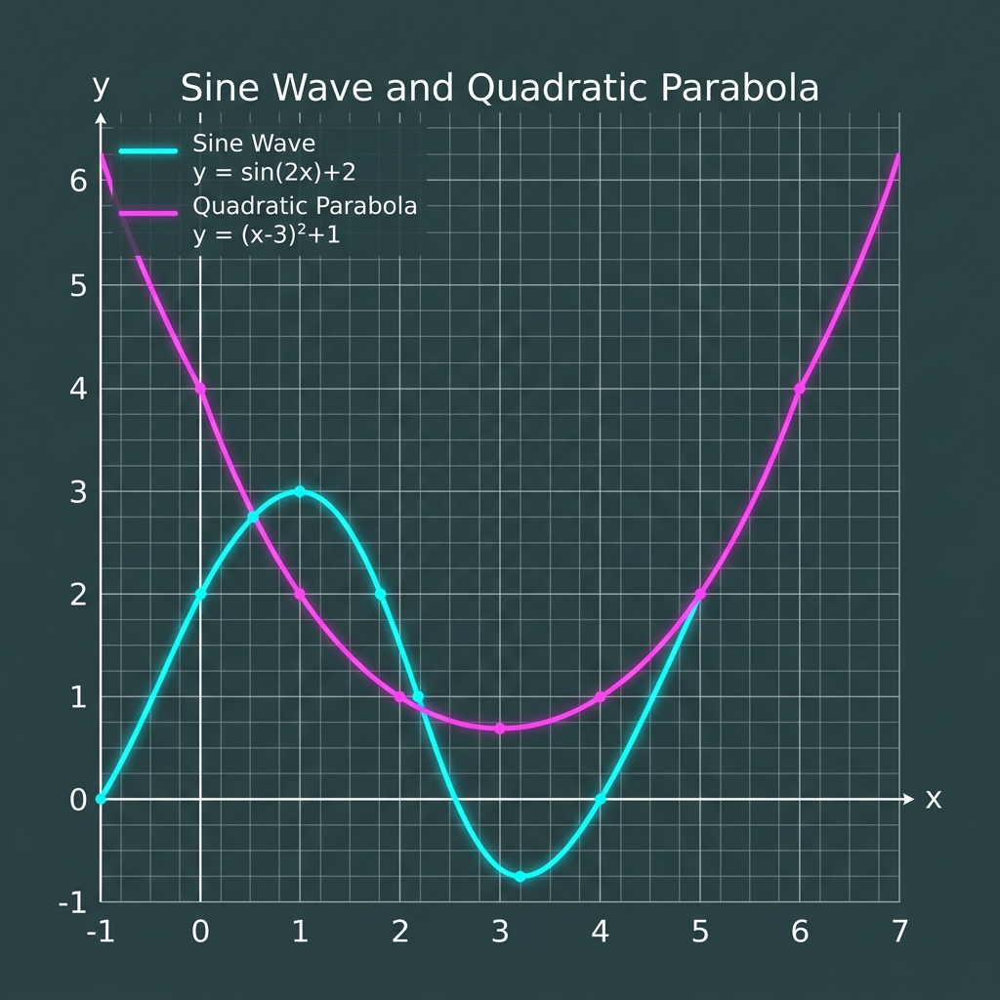

# Technical Mathematics Test Document

This document demonstrates and tests mathematical equations spanning both Algebra and Calculus, rendered using three distinct dialects: LaTeX, Typst typeset, and SymPy. 

### Skip to H3: Algebra Equations

Below are five algebra-themed equations.

1. **LaTeX (Algebra 1)**: The expansion of a binomial squared.
$$(a+b)^2 = a^2 + 2ab + b^2$$

2. **LaTeX (Algebra 2)**: The quadratic formula to solve $ax^2 + bx + c = 0$ in fraction format.
$$x = \frac{-b \pm \sqrt{b^2 - 4ac}}{2a}$$

3. **SymPy (Algebra 3)**: Factoring the difference of two squares.
py:{a**2 - b**2 = (a - b)*(a + b)}

4. **Typst (Algebra 4)**: The logarithmic product rule.
t:{log_b(x y) = log_b(x) + log_b(y)}

5. **SymPy (Algebra 5)**: The determinant of a $2 \times 2$ matrix.
py:{det(Matrix([[a, b], [c, d]])) = a*d - b*c}

### Skip to H3: Calculus Equations

Below are five calculus-themed equations.

6. **LaTeX (Calculus 1)**: The fundamental trigonometric limit.
$$\lim_{x \to 0} \frac{\sin x}{x} = 1$$

7. **Typst (Calculus 2)**: The Fundamental Theorem of Calculus.
t:{integral_a^b f(x) dif x = F(b) - F(a)}

8. **LaTeX (Calculus 3)**: The derivative of the natural exponential function.
$$\frac{d}{dx}(e^x) = e^x$$

9. **Typst (Calculus 4)**: The solution to the Basel problem.
t:{sum_(n=1)^oo 1/n^2 = pi^2/6}

10. **SymPy (Calculus 5)**: Derivative of the sine function.
py:{diff(sin(x), x) = cos(x)}

## Visual Representation

Here is a graph visualising some of the functions:

## Tabular Data (Inaccessible Layout)

| | Value A | Value B | |
|---|---|---|---|
| Row 1 | 12.5 | 14.2 | 19.1 |
| Row 2 | 10.1 | 9.8 |
| Row 3 | 22.0 |
